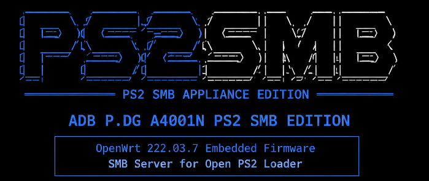

<p align="center">

</p>

# ADB P.DG A4001N PS2 SMB Appliance Edition

Firmware personalizado basado en **OpenWrt 22.03.7** que transforma el router **ADB P.DG A4001N** en un servidor **SMB dedicado para PlayStation 2**, optimizado para **Open PS2 Loader (OPL)**.

Su objetivo es ofrecer una solución simple, ligera y estable para cargar juegos desde un dispositivo USB compartido mediante Samba, sin necesidad de instalar paquetes adicionales ni realizar configuraciones complejas.

---

# Características

- Basado en OpenWrt 22.03.7
- Servidor Samba 3.6 integrado
- Compatible con Open PS2 Loader (OPL)
- Protocolo SMB1 / NT1
- Compatibilidad con dispositivos USB FAT32 y exFAT
- Automontaje del almacenamiento USB en `/mnt/usb`
- Recurso compartido SMB `PS2SMB`
- Sin usuario ni contraseña
- Optimizado para hardware con 32 MB de RAM
- Firmware listo para usar

---

# Filosofía del proyecto

Este firmware **no pretende reemplazar a OpenWrt**, sino convertir el router ADB P.DG A4001N en un dispositivo dedicado exclusivamente a servir juegos de PlayStation 2 mediante SMB.

Se eliminaron funciones y componentes innecesarios para reducir el consumo de memoria y ofrecer el mayor rendimiento posible durante la transferencia de datos.

---

# Únicos componentes incluidos

- OpenWrt 22.03.7
- Samba 3.6
- Soporte USB Storage
- Automontaje mediante Hotplug
- Soporte FAT32
- Soporte exFAT
- Servidor NetBIOS (nmbd)
- Compartición SMB optimizada para OPL

---

# Configuración de Open PS2 Loader (OPL)

Configure OPL con los siguientes parámetros:

| Opción | Valor |
|---------|-------|
| Servidor SMB | **192.168.1.1** |
| Puerto | **445** |
| Carpeta compartida | **PS2SMB** |
| Usuario | *(vacío)* |
| Contraseña | *(vacía)* |

---

# ⚠️ INSTALACIÓN DEL FIRMWARE

## Requisitos

- Router ADB P.DG A4001N
- Cable Ethernet
- Un PC conectado por Ethernet
- Navegador web
- Archivo:

```
ADB-PDG-A4001N-PS2-SMB-Appliance-Edition-v1.0-cfe.bin (o builds posteriores)
```

---

## Configurar una IP estática en el PC

Antes de iniciar el proceso de flasheo configure temporalmente la interfaz Ethernet del PC con los siguientes valores:

| Parámetro | Valor |
|-----------|-------|
| Dirección IP | **192.168.1.2** |
| Máscara de subred | **255.255.255.0** |
| Puerta de enlace | **192.168.1.1** |

No es necesario configurar servidores DNS.

---

## Ingresar al modo CFE

1. Apague el router.
2. Conecte el cable Ethernet entre el PC y el router.
3. Introduzca un objeto fino dentro del orificio **ubicado en el panel trasero** presione y mantenga presionado el botón interno.
4. Encienda el router sin soltar el botón.
5. Espere aproximadamente **15 segundos** y suelte el botón.
   (El router iniciará en **modo CFE (Recovery Mode)**.)

6. Abra un navegador web y acceda a:

   ```
   http://192.168.1.1
   ```
   (Se mostrará la página de recuperación del CFE.)
   
7. Seleccione el archivo:

```
ADB-PDG-A4001N-PS2-SMB-Appliance-Edition-v1.0-cfe.bin (o versiones posteriores)
```

8. Clique el boton **Update Software** o similar.
   Espere a que el proceso finalice completamente, generalmente no deberia tardar mas de 5 minutos.
   **No desconecte la alimentación durante el flasheo.**

Al finalizar, el router se reiniciará automáticamente.

---

## Después del flasheo

Una vez instalado el firmware puede volver a configurar la interfaz Ethernet del PC para obtener la dirección IP automáticamente (DHCP) o restaurar la configuración de red que utilizaba anteriormente.

---

# Primer uso

1. Conecte el dispositivo USB.
2. El almacenamiento será montado automáticamente en:

```
/mnt/usb
```

3. El recurso compartido **PS2SMB** estará disponible automáticamente para Open PS2 Loader.

---

# Sistemas de archivos compatibles

- FAT32
- exFAT

---

# Estado del proyecto

**Versión 1.0**

Primera versión estable del firmware.

Características verificadas:

- Arranque correcto.
- Servidor Samba funcionando correctamente.
- Automontaje de dispositivos USB.
- Intercambio de dispositivos USB en caliente (Hot Swap).
- Compatibilidad con FAT32.
- Compatibilidad con exFAT.
- Detección correcta desde Open PS2 Loader.
- Carga de juegos mediante SMB.
- Consumo de memoria estable durante el funcionamiento.

<h2>Notas</h2>
<h2>Acceso al sistema (SSH)</h2>

<p>
Esta versión incluye únicamente acceso mediante <strong>SSH</strong>; no dispone de interfaz web (<strong>LuCI</strong>). 
</p>
<p>
La administración del sistema, <strong>en caso de ser necesaria</strong>, puede realizarse utilizando un cliente como <strong>PuTTY</strong>.
</p>

<table>
    <tr>
        <th>Parámetro</th>
        <th>Valor</th>
    </tr>
    <tr>
        <td>Dirección IP</td>
        <td><code>192.168.1.1</code></td>
    </tr>
    <tr>
        <td>Puerto</td>
        <td><code>22</code></td>
    </tr>
    <tr>
        <td>Usuario</td>
        <td><code>root</code></td>
    </tr>
    <tr>
        <td>Contraseña</td>
        <td><em>(vacía, en la configuración inicial)</em></td>
    </tr>
</table>
